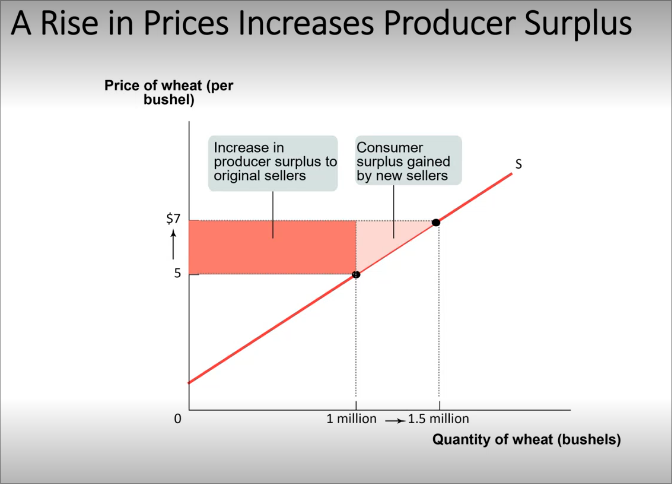

# Consumer Surplus
	- #+BEGIN_PINNED
	  A consumer's **willingness to pay** for a good is the maximum price at which he or she would buy that good. #definition 
	  #+END_PINNED
	- #+BEGIN_PINNED
	  **Individual consumer surplus** is the net gain to an individual buyer from the purchase of a good.  #definition 
	  #+END_PINNED
		- Individual Consumer Surplus Formula #formula
			- #+BEGIN_IMPORTANT
			  #+BEGIN_EXPORT latex
			  \textbf{individual consumer surplus} = \text{buyer's willingness to pay} - \text{price paid}
			  #+END_EXPORT 
			  #+END_IMPORTANT
	- 
	- #+BEGIN_PINNED
	  **Total consumer surplus** is the sum of all the individual consumer surpluses.  #definition 
	  #+END_PINNED
	- Total Consumer Surplus Formula #formula
		- #+BEGIN_IMPORTANT
		  #+BEGIN_EXPORT latex
		  \textbf{total consumer surplus} = \text{area between demand curve and the equilibrium price}
		  #+END_EXPORT 
		  #+END_IMPORTANT
	- 
	- 
	- ## Changes in prices affects consumer surpluses
		- e.g. fall of price increases consumer surplus:
			- gain to consumers who would have bought at original price
			- gain to consumers persuaded to buy at lower price
			- 
- # Producer Surplus
	- #+BEGIN_PINNED
	  A potential seller's **cost** is the lowest price at which they are willing to sell a good. #definition 
	  #+END_PINNED
	- #+BEGIN_PINNED
	  **Individual producer surplus** is the net gain to a seller from selling a good. #definition 
	  #+END_PINNED
	- Individual Producer Surplus Formula #formula
		- #+BEGIN_IMPORTANT
		  #+BEGIN_EXPORT latex
		  \textbf{individual producer surplus} = \text{price received} - \text{seller's cost}
		  #+END_EXPORT 
		  #+END_IMPORTANT
	- 
	- #+BEGIN_PINNED
	  **Total producer surplus** is the sum of all the individual producer surpluses. #definition 
	  #+END_PINNED
	- Total Producer Surplus Formula #formula
	- #+BEGIN_IMPORTANT
	  #+BEGIN_EXPORT latex
	  \textbf{total producer surplus} = \text{area above supply curve but below equilibrium price}
	  #+END_EXPORT 
	  #+END_IMPORTANT
	- 
	- 
	- ## Changes in prices affects producer surpluses
		- e.g. increase in prices of goods
			- benefit to original priducers
			- benefit to new suppliers
			- 
- # Total Surplus
	- #+BEGIN_PINNED
	  **Total surplus** is the total net gain to *consumers* and *producers*. #definition 
	  #+END_PINNED
	- Total Surplus Formula #formula
	- #+BEGIN_IMPORTANT
	  #+BEGIN_EXPORT latex
	  \textbf{total surplus} = \text{consumer surplus} + \text{producer surplus}
	  #+END_EXPORT 
	  #+END_IMPORTANT
	- 
	- ## Why do markets work so efficiently?
		- Maximize the *total surplus* of consumers and producers.
		- The *efficiency of markets* is why trade is so good
		- At equilibrium:
			- everyone who wants to buy the good at the price gets to buy it
			- everyone who wants to sell at a price can do so
			- *mutually beneficial* -> everyone can benefit from the transaction
				- ==buyer values good more than seller==
			- #+BEGIN_NOTE
			  *Buyers* for whom *price is too high* and *sellers* for whom *price is too low*, will not engage in the market
			  #+END_NOTE
			- i.e. ==no scarcities and efficient allocation of resources==
	- ## Why do markets work so well?
		- *Property rights* -> rights of owners of items to do as they choose with said items
		  logseq.order-list-type:: number
		- *Economic signals*
		  logseq.order-list-type:: number
			- #+BEGIN_NOTE
			  Price signifies *scarcity*.
			  #+END_NOTE
		- #+BEGIN_NOTE
		  The market does not imply best outcome for every buyer and seller, it just maximizes the best outcome.
		  #+END_NOTE
	- #+BEGIN_PINNED
	  A market is **inefficient** is if there are missed opportunities, some people could be better off without making others worse off.
	  #+END_PINNED
	- Factors of *market failure*:
		- externalities
		  logseq.order-list-type:: number
		- problems in the nature of the goods themselves (e.g. public goods)
		  logseq.order-list-type:: number
		- market power
		  logseq.order-list-type:: number