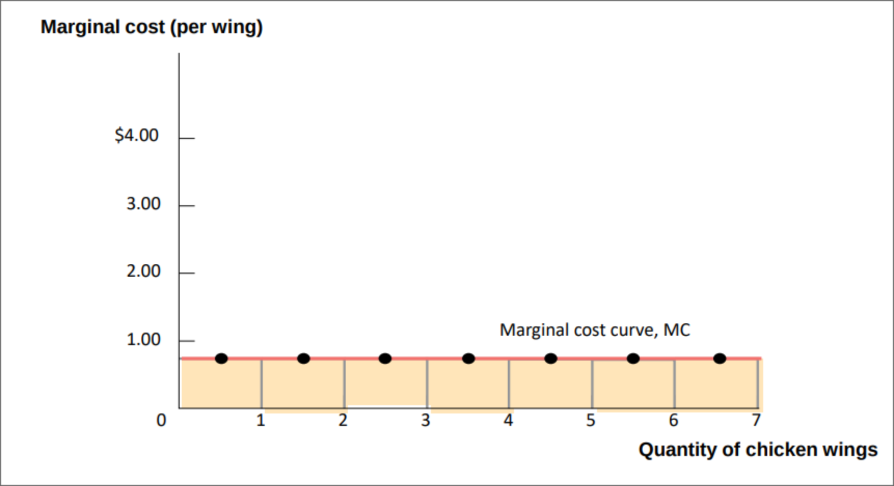
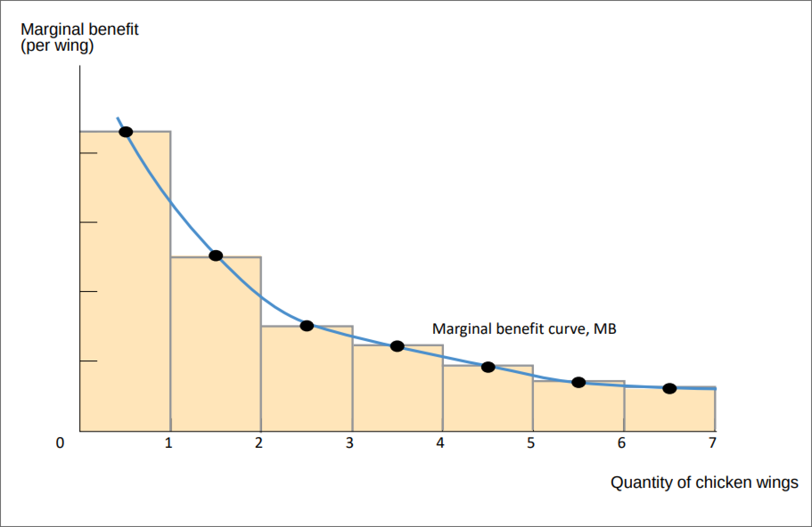
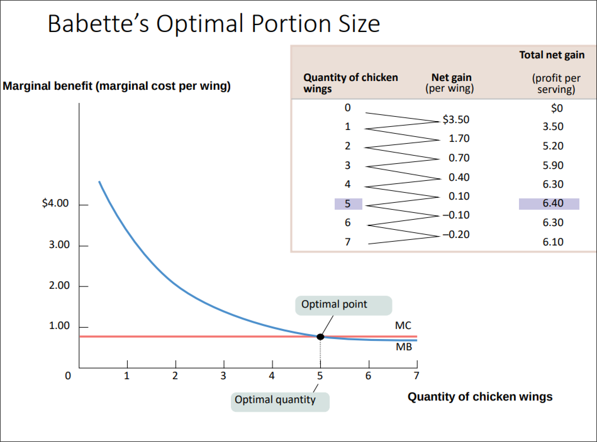

banner:: https://images.unsplash.com/photo-1429743305873-d4065c15f93e?crop=entropy&cs=tinysrgb&fit=max&fm=jpg&ixid=M3wyNDYwNDl8MHwxfHNlYXJjaHwzfHxkZWNpc2lvbnN8ZW58MHx8fHwxNjk4MDUwOTgwfDA&ixlib=rb-4.0.3&q=80&w=400

- #+BEGIN_PINNED
  An **explicit cost** is a cost that involves actually laying out money. #definition 
  #+END_PINNED
- #+BEGIN_PINNED
  An **implicit cost** is a cost not measured in monetary value, but rather benefits that are foregone. #definition 
  #+END_PINNED
- #+BEGIN_PINNED
  The **accounting profit** is total revenue minus explicit costs and depreciation. #definition 
  #+END_PINNED
- Accounting Profit Formula #formula
	- #+BEGIN_IMPORTANT
	  #+BEGIN_EXPORT latex
	  \text{accounting profit} = \text{total revenue} - \text{(explicit costs } + \text{ depreciation)}
	  #+END_EXPORT
	  #+END_IMPORTANT
- #+BEGIN_PINNED
  **Economic profit** is total revenue minus opportunity costs of resources. #definition 
  #+END_PINNED
- Economic Profit Formula #formula
	- #+BEGIN_IMPORTANT
	  
	  #+BEGIN_EXPORT latex
	  \text{economic profit} = \text{total revenue} - \text{(explicit costs } + \text{ depreciation)} - \text{implicit costs}
	  #+END_EXPORT 
	  #+END_IMPORTANT
- #+BEGIN_PINNED
  **Marginal cost** of producing a good or service is the additional cost incurred by producing one more unit of a good or service. #definition 
  #+END_PINNED
	- e.g.  if you are making 100 cakes, by the time you get to the 100th cake you will be tired, hence you have to put more effort (= higher cost) into the cake, so the ==marginal cost== will be higher
	- 
- #+BEGIN_PINNED
  **Marginal benefit** of producing a good or service is the additional benefit earned from one or more unit of that good or service. #definition
  #+END_PINNED
	- The more you have of something, the less you will want more of it. Hence, *marginal benefit curve* has a negative slope.
	- 
- #+BEGIN_PINNED
  The **optimal quantity** is the quantity that generates the maximum possible total net gain. #definition 
  #+END_PINNED
- Principle of Marginal Analysis #formula
	- #+BEGIN_IMPORTANT
	  
	  #+BEGIN_EXPORT latex
	  \text{marginal benefit} = \text{marginal cost}
	  #+END_EXPORT 
	  #+END_IMPORTANT
- 
- #+BEGIN_PINNED
  **Sunk cost** is the cost that has already been incurred and it is *non-recoverable*.
  #+END_PINNED
	- They have no bearing on the future and can be ignored.
- # Behavioral Economics
	- *Behavioral economics* focuses on when people make irrational decisions.
	- Four reasons people might rationally choose a worse payoff:
		- Concerns about fairness (helping others might sometimes trump self-interest)
		  logseq.order-list-type:: number
		- Non-monetary rewards (e.g. going on a holiday)
		  logseq.order-list-type:: number
		- Bounded rationality (when the option is "good enough", but not necessarily the one with the best payoff)
		  logseq.order-list-type:: number
		- Risk aversion (willingness to sacrifice some economic payoff in order to avoid a potential loss)
		  logseq.order-list-type:: number
	- Common mistakes in decision making:
		- Misconceptions of opportunity costs
		  logseq.order-list-type:: number
		- Overconfidence
		  logseq.order-list-type:: number
		- Unrealistic expectations about future behavior
		  logseq.order-list-type:: number
		- Counting dollars unequally (e.g. paying with cash vs with card)
		  logseq.order-list-type:: number
		- Loss aversion
		  logseq.order-list-type:: number
		- Framing bias
		  logseq.order-list-type:: number
		- Status quo bias
		  logseq.order-list-type:: number
- # Temporal Decisions
	- #+BEGIN_PINNED
	  **Time discounting** is the process whereby the individuals place a *lower value* on a gain or loss taking place at some point in the *future* rather than in the present. #definition 
	  #+END_PINNED
	- #+BEGIN_PINNED
	  **Present value** is the value of on a given date of a series of future payments that are discounted at a rate reflecting time preferences. #definition 
	  #+END_PINNED
	- #+BEGIN_NOTE
	  Interest rate compares the the value of a dollar today versus a dollar later.
	  #+END_NOTE
	- Interest Rate Formula #formula
		- #+BEGIN_IMPORTANT
		  
		  #+BEGIN_EXPORT latex
		  \text{\$1 in the future} = \frac{\text{\$1 in the present}}{1 + r} \text{, where r is the interest rate}
		  #+END_EXPORT 
		  #+END_IMPORTANT
	- Present Value Formula #formula
		- #+BEGIN_IMPORTANT
		  
		  #+BEGIN_EXPORT latex
		  \text{Present Value (PV)} = \frac{\text{Inc}_1}{(1+r)^1} + \frac{\text{Inc}_2}{(1+r)^2} + \frac{\text{Inc}_3}{(1+r)^3} + \cdots + \frac{\text{Inc}_t}{(1+r)^t}
		  #+END_EXPORT 
		  #+END_IMPORTANT
		- #+BEGIN_NOTE
		  This represents *future cash-flow*, discounted to present money.
		  #+END_NOTE
	- Net Present Value Formula #formula
		- #+BEGIN_IMPORTANT
		  
		  #+BEGIN_EXPORT latex
		  \text{Net Present Value (NPV)} = \text{PV} - \text{initial investment}
		  #+END_EXPORT 
		  #+END_IMPORTANT
		- #+BEGIN_NOTE
		  Project is ==profitable== if *NPV > 0*.
		  #+END_NOTE