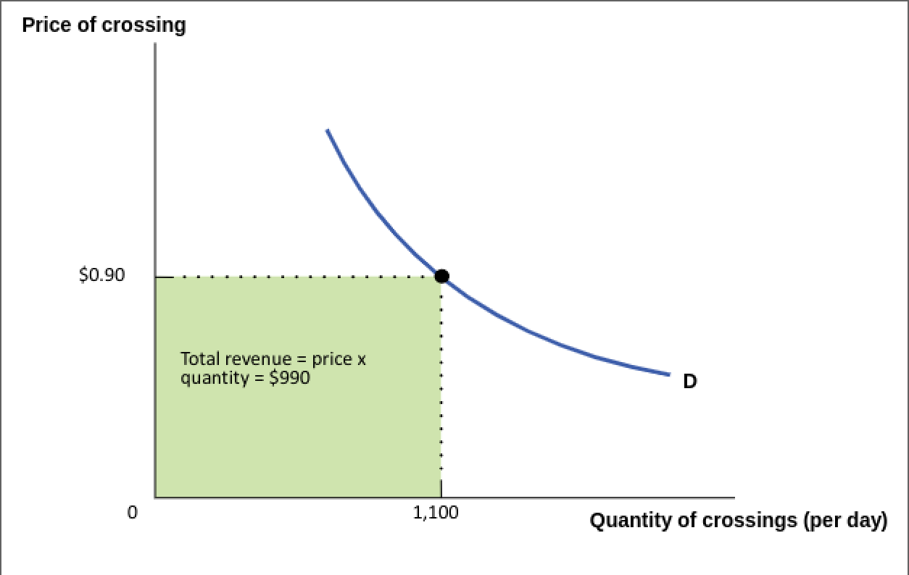

- #+BEGIN_NOTE
  Implementing policies that *increase labor*, are generally bad, because that labor could have been diverted somewhere *more productive*.
  #+END_NOTE
- #+BEGIN_PINNED
  The **price elasticity of demand** is the ratio of the percent change in the *quantity demanded* to the percent change in the *price* as we move along the *demand curve*. #definition 
  #+END_PINNED
	- #+BEGIN_NOTE
	  The more *elastic* a good is, the more ==responsive== it is to ==price changes==.
	  #+END_NOTE
	- 
- Percent Change in Quantity Demanded Formula #formula
	- #+BEGIN_IMPORTANT
	  
	  #+BEGIN_EXPORT latex
	  \text{\% change in quantity demanded} = \frac{\text{change in quantity demanded}}{\text{initial quantity demanded}} \times 100
	  #+END_EXPORT 
	  #+END_IMPORTANT
- Percent Change in Price Formula #formula
	- #+BEGIN_IMPORTANT
	  
	  #+BEGIN_EXPORT latex
	  \text{\% change in price} = \frac{\text{change in price}}{\text{initial price demanded}} \times 100
	  #+END_EXPORT 
	  #+END_IMPORTANT
- Price Elasticity of Demand Formula #formula
	- #+BEGIN_IMPORTANT
	  
	  #+BEGIN_EXPORT latex
	  \text{price elasticity of demand} = \frac{\frac{\Delta{Q}}{Q}}{\frac{\Delta{P}}{P}} = \frac{P}{Q} \times \frac{\Delta{Q}}{\Delta{P}}
	  #+END_EXPORT 
	  #+END_IMPORTANT
	- #+BEGIN_NOTE
	  
	  #+BEGIN_EXPORT latex
	  \frac{\Delta{Q}}{\Delta{P}} \text{ is the gradient of the line curve}
	  #+END_EXPORT 
	  
	  P and Q can be any points on the curve, e.g. *equilibrium* coordinates
	  #+END_NOTE
- #+BEGIN_NOTE
  
  #+BEGIN_EXPORT latex
  \text{elasticity} \neq \text{slope}
  #+END_EXPORT 
  #+END_NOTE
- #+BEGIN_NOTE
  
  #+BEGIN_EXPORT latex
  \text{\% change in quantity} > \text{\% change in price} \implies \text{elastic} \\
  \text{\% change in quantity} < \text{\% change in price} \implies \text{inelastic}
  #+END_EXPORT 
  #+END_NOTE
- #+BEGIN_PINNED
  **Unit-elastic** is when the elasticity is *1*. #definition 
  #+END_PINNED
	- 
- #+BEGIN_PINNED
  Demand is **perfectly elastic** when any *price increase* will cause the *quantity demanded* to drop down to *zero*. #definition 
  #+END_PINNED
	- #+BEGIN_NOTE
	  
	  #+BEGIN_EXPORT latex
	  \text{elasticity of demand} = \infty
	  #+END_EXPORT 
	  #+END_NOTE
	- 
- #+BEGIN_PINNED
  Demand is **perfectly inelastic** when the *quantity demanded* does *not respond* to any changes in the *price*. #definition 
  #+END_PINNED
	- #+BEGIN_NOTE
	  
	  #+BEGIN_EXPORT latex
	  \text{elasticity of demand} = 0
	  #+END_EXPORT 
	  #+END_NOTE
	- 
- #+BEGIN_PINNED
  **Total revenue** is the *total value* of sales of a good or service. #definition 
  #+END_PINNED
- Total Revenue Formula #formula
	- #+BEGIN_IMPORTANT
	  
	  #+BEGIN_EXPORT latex
	  \text{total revenue} = \text{price} \times \text{quantity sold}
	  #+END_EXPORT 
	  #+END_IMPORTANT
	- 
	- When a price changes:
		- *price effect* $\implies$ each unit has a different price
		- *quantity effect* $\implies$ change in demand for good
		- 
- #+BEGIN_NOTE
  If a good is *elastic*, then the demand is very ==responsive==, meaning an ==increase in price== will ==reduce total revenue==.
  #+END_NOTE
- #+BEGIN_NOTE
  If a good is *inelastic*, then the demand will ==not respond== to the ==price change==, meaning that an ==increase in price== will ==increase total revenue==.
  #+END_NOTE
- #+BEGIN_NOTE
  On a *straight-line demand curve*, the left side tends to be ==inelastic== and right side tends to be ==elastic==.
  #+END_NOTE
	- 
- Unit Elasticity Formula #formula
	- #+BEGIN_IMPORTANT
	  Consider demand curve: *Q = a - bP*
	  
	  First we need to find where elasticity = 1. That would be when total revenue (TR) is either maximum or minimum. We know that:
	  
	  #+BEGIN_EXPORT latex
	  \text{TR} = P \times Q = P \times (a - bP) = aP - bP^2 \\
	  \text{So:} \\
	  \frac{\delta{\text{TR}}}{\delta{P}} = a -2bP = 0 \text{ (we are trying to find extrema)} \\
	  \implies P = \frac{a}{2b} \\
	  \text{Taking the second derivative we get: } \\
	  \frac{\delta^2{\text{TR}}}{\delta{P}^2} = -2b \\
	  \text{Plugging in our extrema into our second derivative gives us a negative value.} \\
	  \therefore \text{ Point is a maximum.}
	  #+END_EXPORT
	  
	  If we go beyond that point, TR will drop which happens when region is elastic. 
	  #+END_IMPORTANT
	- {{renderer excalidraw, excalidraw-2023-10-18-10-50-03}}
- Price elasticity of demand is determined by:
	- availability of *substitutes*
	- whether good is *necessity* or a *luxury*
	- *share of income* spent on good
	- time
		- people find *substitutes* to mitigate price increases $\implies$ *elastic* in the long run
	- inputs
		- more readily *available inputs* $\implies$ *higher elasticity*
- id:: 6523bd44-4121-47d0-807e-d113ed12811a
  #+BEGIN_PINNED
  **Cross price elasticity** measures the effect of change in one good's demand on the quantity of another good's price. #definition 
  #+END_PINNED
- Cross Price Elasticity Formula #formula
	- #+BEGIN_IMPORTANT
	  
	  #+BEGIN_EXPORT latex
	  \text{cross price elasticity of demand} = \frac{\% \Delta \text{ quantity of good A demanded}}{\% \Delta \text{ price of good B}}
	  #+END_EXPORT 
	  #+END_IMPORTANT
- #+BEGIN_NOTE
  Goods are *substitutes* when the *cross price elasticity* is ==positive== .
  I.e. good B price increases $\iff$ good A demand increases
  
  If they are *complements* then *cross price elasticity* is ==negative==.
  I.e. good B price increases $\iff$ good A demand decreases
  #+END_NOTE
- #+BEGIN_PINNED
  **Income elasticity** measures the effect of change in one good's demand based on the consumer's *change in income*. #definition 
  #+END_PINNED
	- Income Elasticity Formula #formula
		- #+BEGIN_IMPORTANT
		  
		  #+BEGIN_EXPORT latex
		  \text{income elasticity of demand} = \frac{\% \Delta \text{ quantity of good A demanded}}{\% \Delta \text{ income}}
		  #+END_EXPORT 
		  #+END_IMPORTANT
- #+BEGIN_NOTE
  Good is *normal* when *income elasticity* is ==positive==.
  I.e. income increases $\iff$ demand for good increases
  
  Good is *inferior* when *income elasticity* is ==negative==.
  I.e. income increases $\iff$ demand for good decreases
  #+END_NOTE