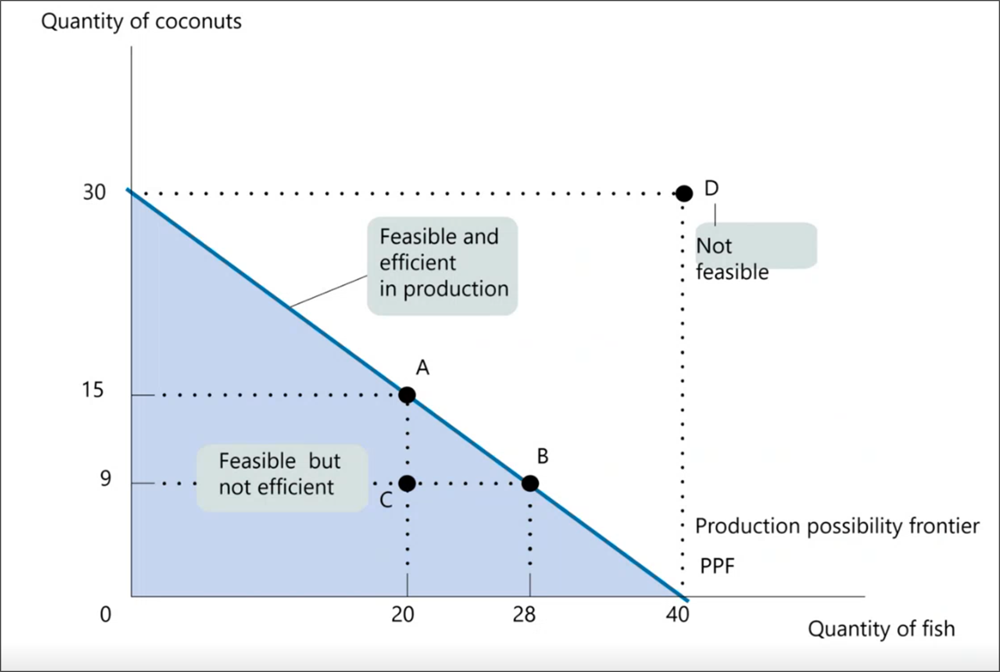
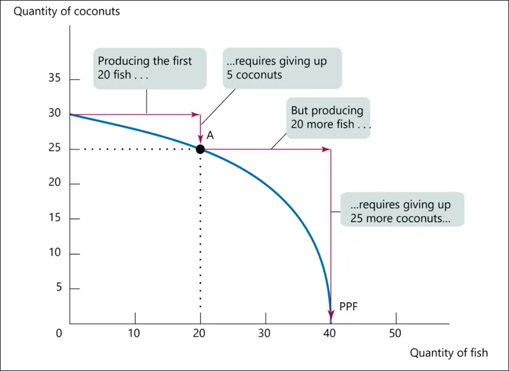
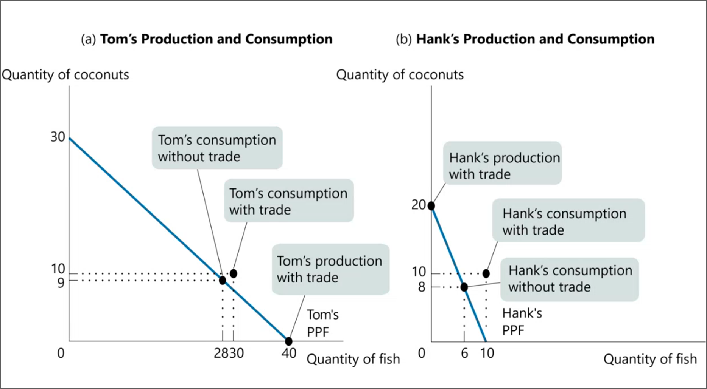

# Definitions
	- #+BEGIN_PINNED
	  A **model** is a simplified representation of a real situation that is used to better understand real-life situations. #definition 
	  #+END_PINNED
	- Models can be:
		- theoretical
		- empirical
	- #+BEGIN_PINNED
	  The **other things equal** assumption means that all other factors remain unchanged. #definition 
	  #+END_PINNED
	- #+BEGIN_PINNED
	  The **counterfactual** describes a reality described by models. #definition 
	  #+END_PINNED
- # Production Possibility Frontier (PPF)
	- Graphical model
	- Illustrates trade-offs an economy faces when producing _two_ goods
	- Shows maximum quantity of one good that can be produced at the expense of the other
	- Economic growth results in outward shift of the PPF curve
	- Trade can take the amount of goods available past the PPF curve
	- 
	- 
	- id:: 652cecb0-becc-4e36-af48-1fbf44f8e765
	  #+BEGIN_PINNED
	  **Comparative advantage** is when the opportunity cost of producing a good is lower for one party than it is for the other (i.e. when one party is *more efficient* than the other). #definition 
	  #+END_PINNED
	- #+BEGIN_PINNED
	  **Absolute advantage** is when one party can produce a bigger quantity of goods than the other (i.e. when one party is *better* than the other). #definition 
	  #+END_PINNED
	- Trade is generally beneficial for both parties.
		- Ethical issues (e.g. labor laws and environmental concerns) can impact trade relations
		- {:height 420, :width 748}
			- In terms of coconuts:
				- a coconut costs for Tom $\frac{4}{3}$ fish
				- for Hank it costs $\frac{1}{2}$ fish
			- Thus, even though Tom has an absolute advantage, it is still more beneficial for him to specialize in coconuts and trade for fish, since Hank has a comparative advantage in fish
			- #+BEGIN_NOTE
			  Specializing also come with other benefits e.g. production can become more efficient.
			  #+END_NOTE