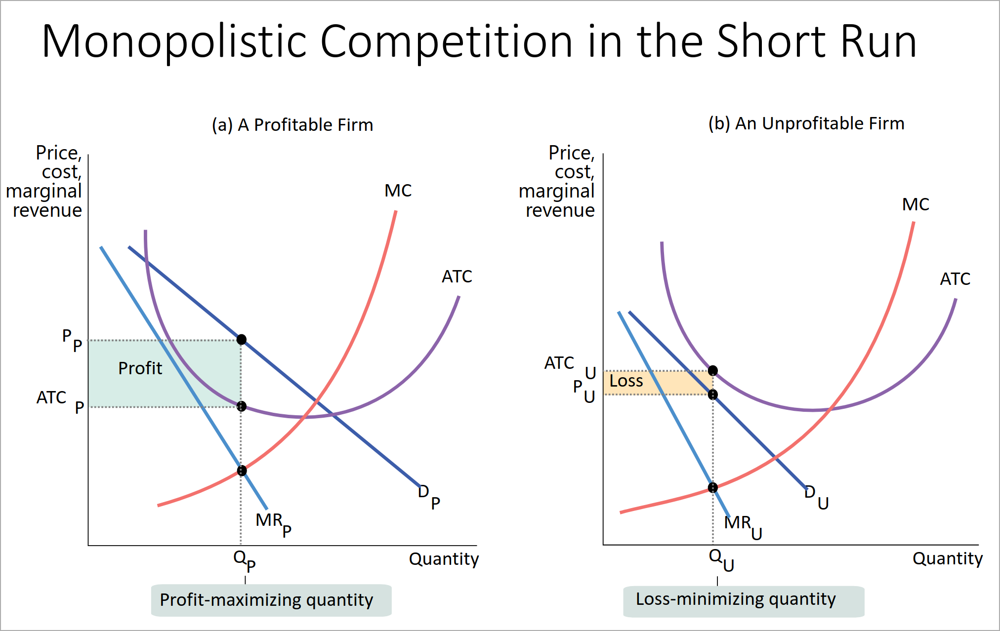
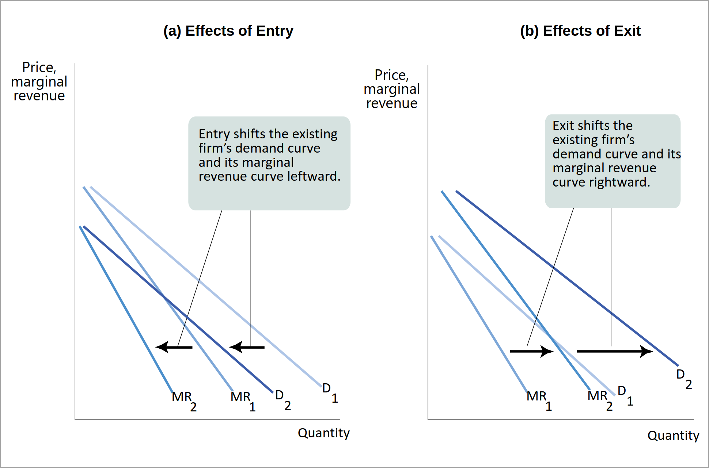
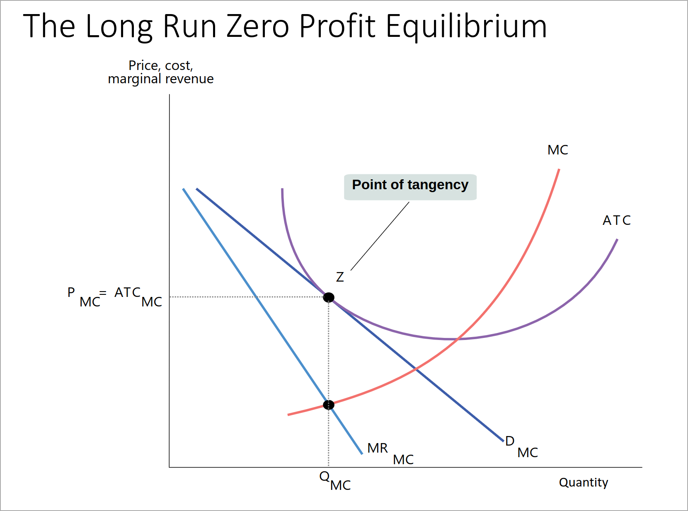
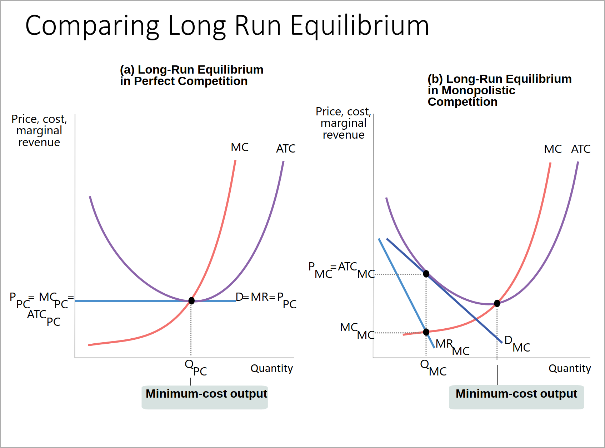

- #+BEGIN_PINNED
  **Monopolistic competition** is a market structure in which there are:
  - *many competing producers*
  - each producer sells a *differentiated product*
  - there is *free entry into and exit* from the industry in the *long run* 
  #definition 
  #+END_PINNED
- Since there are many producers, *collusion* is difficult. Hence, ==product differentiation== is the only way to gain *market power*.
- Examples of product differentiation:
	- Style / type (e.g. sedans vs SUVs)
	- Location
	- Quality
- Important features:
	- *Competition among sellers* 
	  logseq.order-list-type:: number
		- Producers compete for the same market, so entry of new producers reduces what a individual producer sells at any given price
	- *Value in diversity* 
	  logseq.order-list-type:: number
		- Consumers gain from increased diversity of goods
	- *Individual downward-sloping demand curve* 
	  logseq.order-list-type:: number
		- Because the product is differentiated, the firm can act as a monopolist
		- 
	- *Free entry and exit*
	  logseq.order-list-type:: number
		- Individual demand curve shifts when other firms enter or exit the market
		- 
- In the *long-run* the ==zero-profit-equilibrium== is reached where the firms break even.
- 
- 
- There is an ==excess capacity== because *average total cost* can be lower, but then the firm would be operating at a *loss*. This leads to *higher prices* and *lower quantities* .