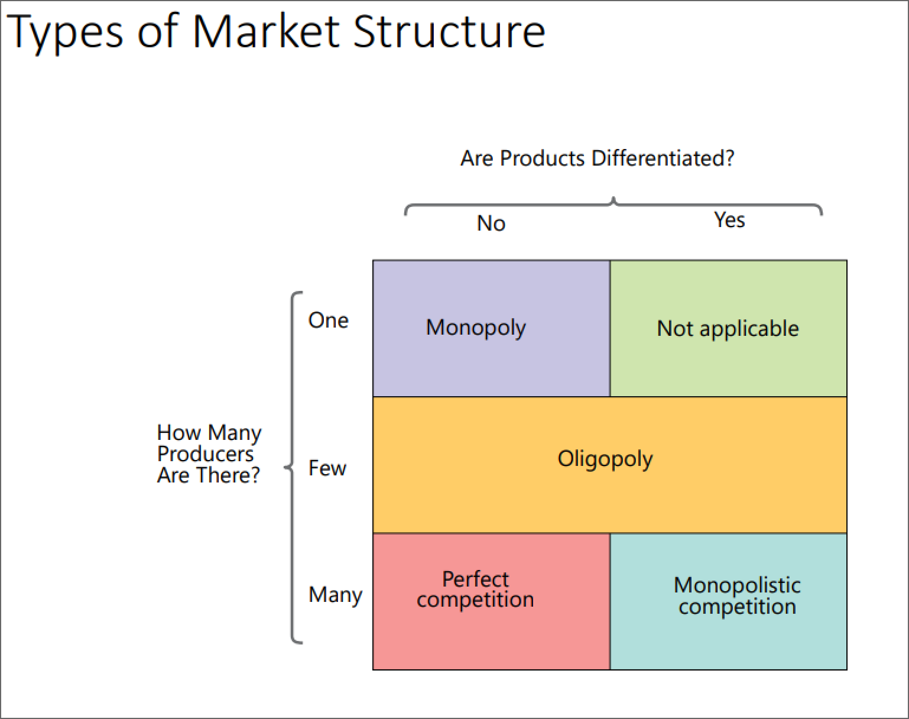
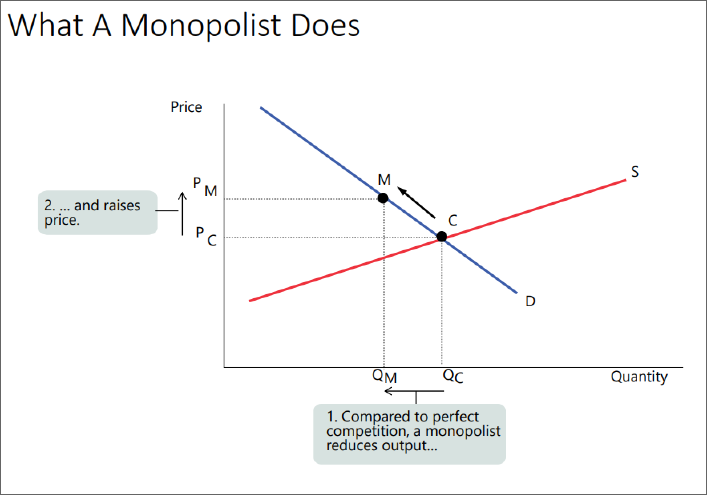
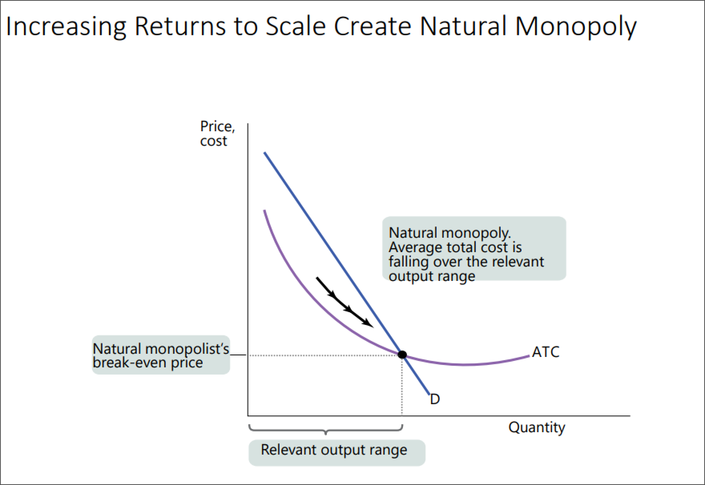
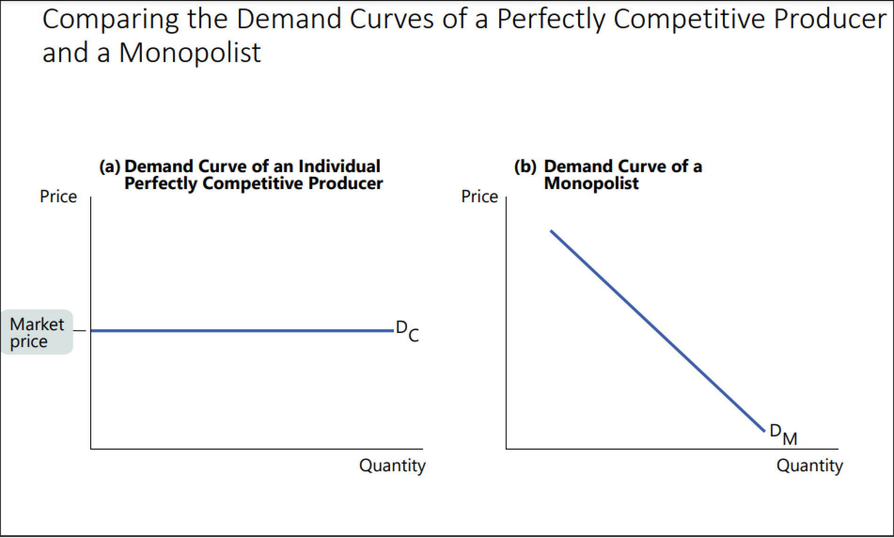
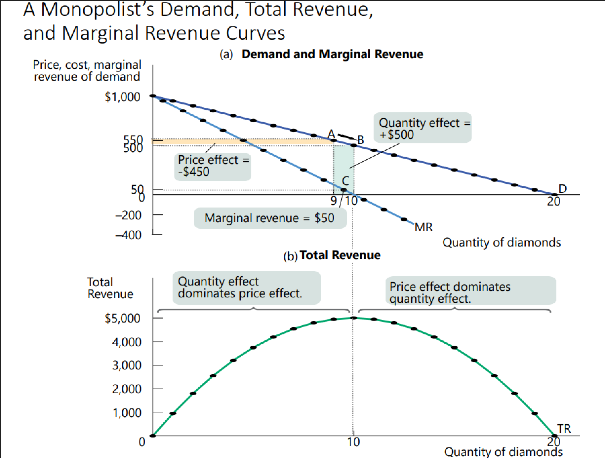
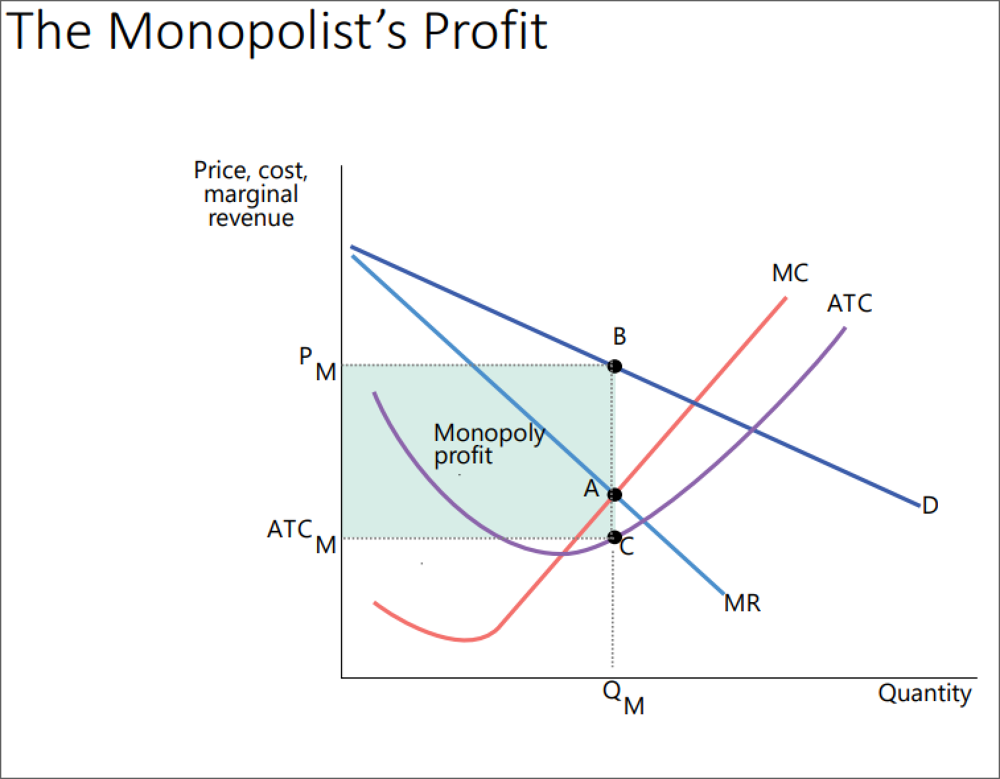

- 
- #+BEGIN_PINNED
  A **monopolist** is a firm that is the only producer of a good that has ==no substitutes==.
  #+END_PINNED
- #+BEGIN_PINNED
  **Market power** is the ability of a *monopolist* to raise a price above the competition by reducing their output. #definition 
  #+END_PINNED
	- 
- #+BEGIN_NOTE
  A monopolist will generate profit both in the *short-run* and in the *long-run*, as long as there exists a ==barrier to entry==.
  #+END_NOTE
- #+BEGIN_PINNED
  A **natural monopoly** exists when increasing returns to scale provide a *large cost advantage* to a *single firm* that produces all of an industry's output. #definition 
  #+END_PINNED
	- #+BEGIN_NOTE
	  In this case *average total cost* ==decreases== over the output range of the industry.
	  
	  This creates a *barrier to entry* because an established monopolist has *lower average total cost* than any other smaller firm.
	  #+END_NOTE
	- 
- Barriers to Entry:
	- Increasing returns to scale
	- Control of scarce resource
	- Technological superiority -> rise to *network externalities*
		- #+BEGIN_PINNED
		  **Network externalities** mean that the value of a good rises as more people use it. #definition 
		  #+END_PINNED
	- Patents and copyrights -> incentivise innovation
- #+BEGIN_NOTE
  Remember: Marginal revenue = marginal cost applies for *all market structures*.
  
  However, for monopolies marginal revenue is *not equal to* price!
  #+END_NOTE
- 
	- This is because a monopolist can ==affect the price of a good==. An individual firm in a *competitive market* can sell as much as they want and they ==will not affect the market demand==.
- #+BEGIN_PINNED
  The **quantity effect** states that with one more unit sold, the *total revenue* increases by the price of the unit of the good sold. #definition 
  #+END_PINNED
- #+BEGIN_PINNED
  The **price effect** states that in order to sell the *last unit*, the monopolist must cur the *market price* on *all* units sold, decreasing *total revenue*. #definition 
  #+END_PINNED
- 
- Marginal Revenue Curve Gradient Formula #formula
	- #+BEGIN_IMPORTANT
	  Demand curve:
	  #+BEGIN_EXPORT latex
	  P = a - bQ
	  #+END_EXPORT
	  
	  We know that:
	  
	  #+BEGIN_EXPORT latex
	  \text{TR} = P \times Q = (a - bQ) \times Q = aQ - bQ^2
	  #+END_EXPORT 
	  And:
	  
	  #+BEGIN_EXPORT latex
	  \text{MR} = \frac{\delta TR}{\delta Q} = a - 2bQ
	  #+END_EXPORT 
	  
	  Hence, *gradient of MR* is twice that of *demand curve*.
	  #+END_IMPORTANT
- Monopolist's Profit-Maximizing Quantity of Output Formula #formula
	- #+BEGIN_IMPORTANT
	  
	  #+BEGIN_EXPORT latex
	  \text{marginal revenue} = \text{ marginal cost}
	  #+END_EXPORT 
	  #+END_IMPORTANT
- 