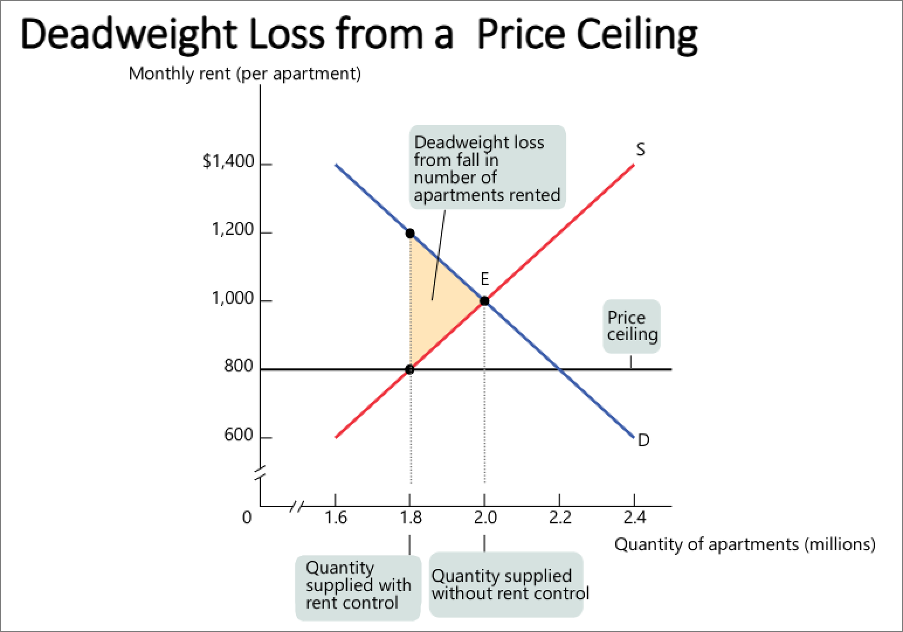
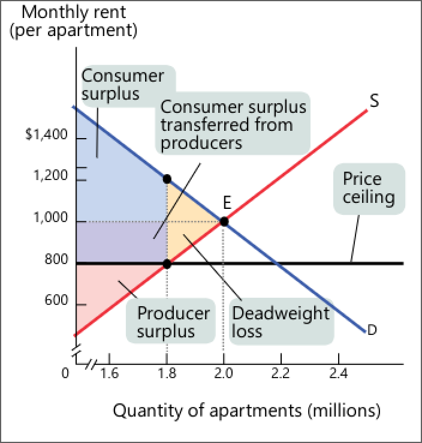
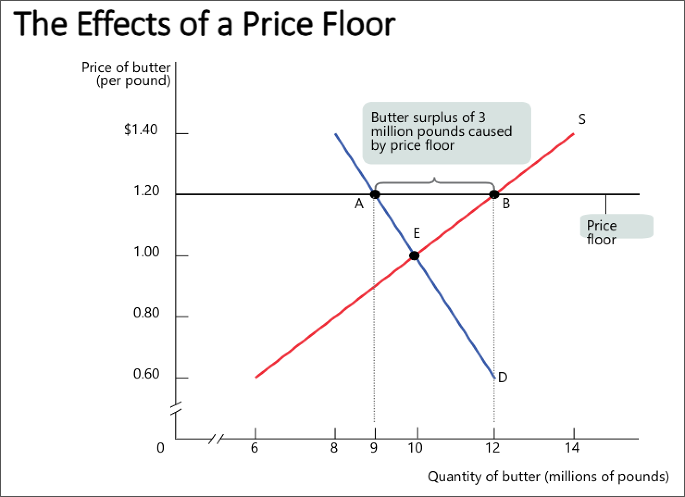
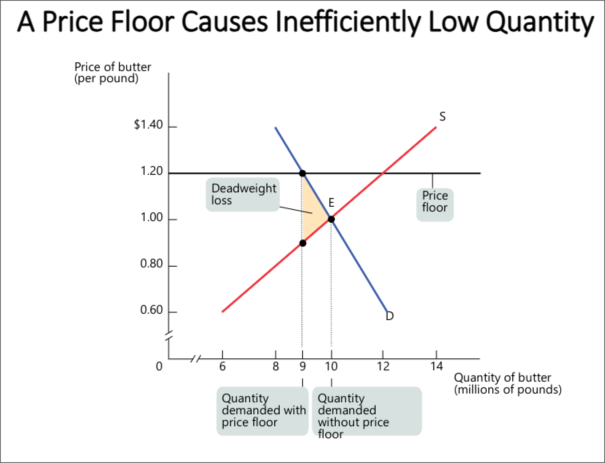

- #+BEGIN_PINNED
  The **rebound effect** is when an increase in the *efficiency* of a good or service increases *demand* for that good or service. #definition 
  #+END_PINNED
	- For example, making gas cars more fuel-efficient will make people want to drive more.
- #+BEGIN_NOTE
  *Market equilibrium* may not be satisfactory if the *equilibrium price* is too high, which will price out many consumers out. The market may be working *efficiently*, since there is a balance between *consumers* and *producers*.
  #+END_NOTE
- Two types of government intervention:
	- #+BEGIN_PINNED
	  **Price controls** are legal restrictions on how high (*price ceiling*) or low (*price floor*) a price can get. #definition 
	  #+END_PINNED
		- #+BEGIN_NOTE
		  *Price ceilings* are generally imposed during crisis and benefit the lucky few in spite of another group of people.
		  #+END_NOTE
		- 
	- Quantity quotas
- #+BEGIN_PINNED
  **Deadweight loss** is the loss of *total surplus* that occurs whenever a policy *reduces the quantity transacted* below the *efficient market equilibrium quantity*. #definition 
  #+END_PINNED
	- Negative effects:
		- there is an *inefficient allocation* to consumers.
		- wasted resources e.g. search costs
		- inefficiently low quality
		- black markets
	- {:height 746, :width 704}
		- lucky few benefit
		- loss of consumer surplus
		- loss of supplier surplus
- ## Price floors
	- e.g. minimum wage
	- 
	- Surplus created
	- Negative effects:
		- *deadweight loss* from inefficiently low quantity
		- *inefficient allocation* of sales among sellers
		- inefficiently high quality
		- black markets
	- 
	- {{renderer excalidraw, excalidraw-2023-10-02-10-48-08}}
	- #+BEGIN_NOTE
	  *Government intervention* can help when the market is *not in a equilibrium state* (i.e. it is not competitive).
	  #+END_NOTE