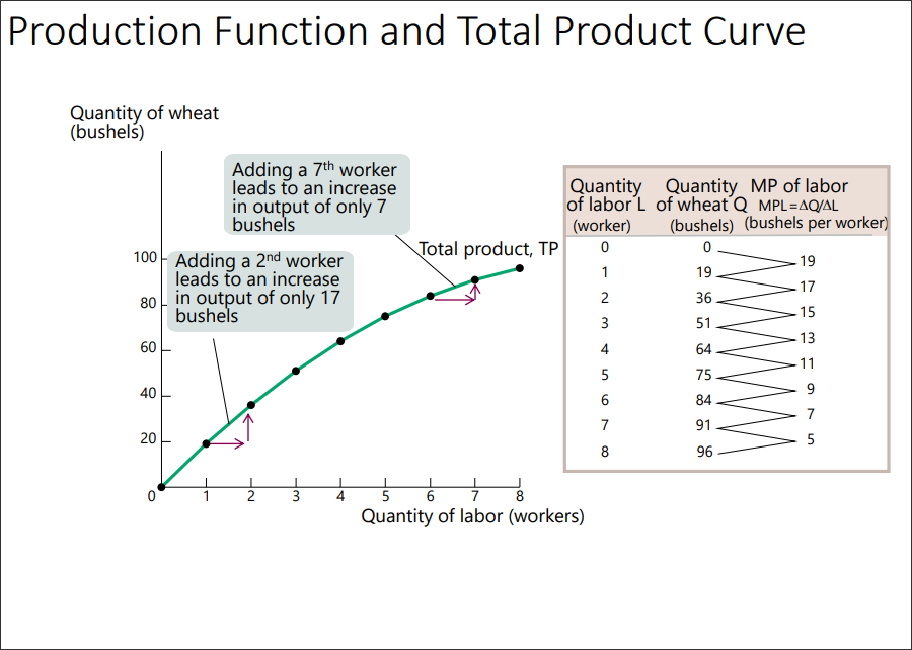
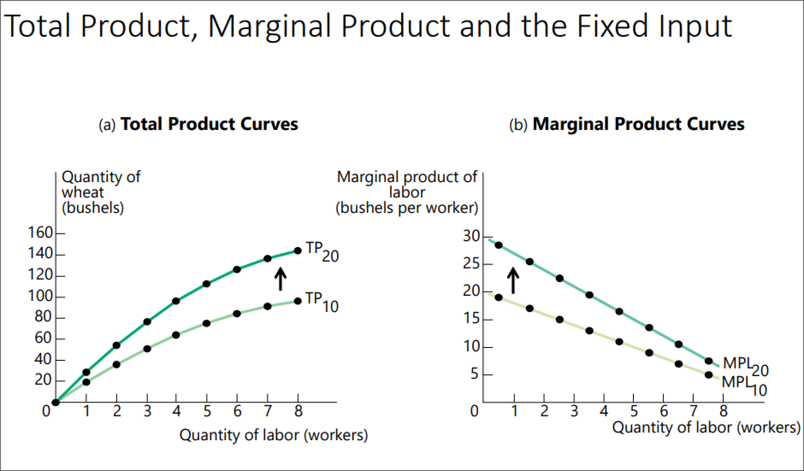
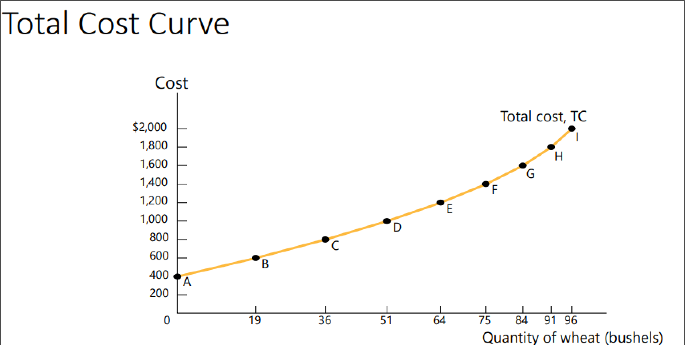
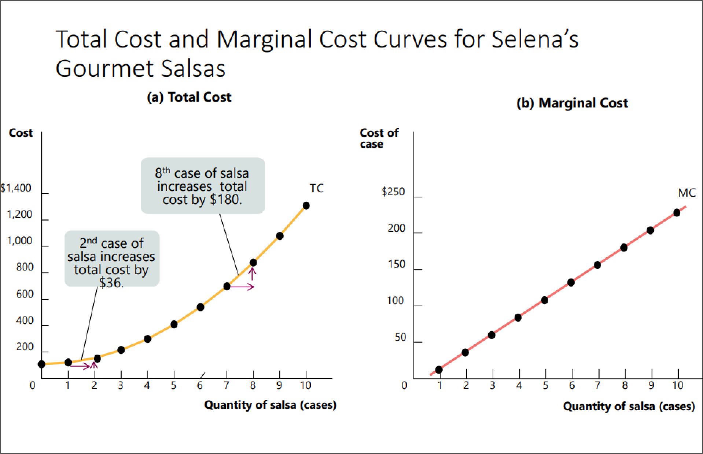
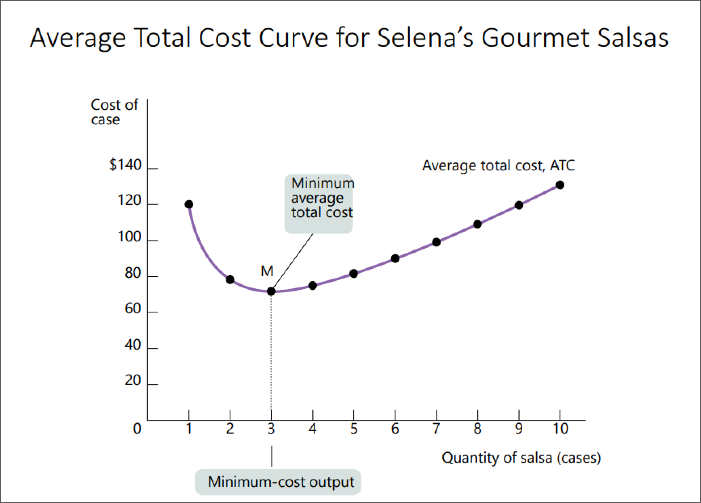
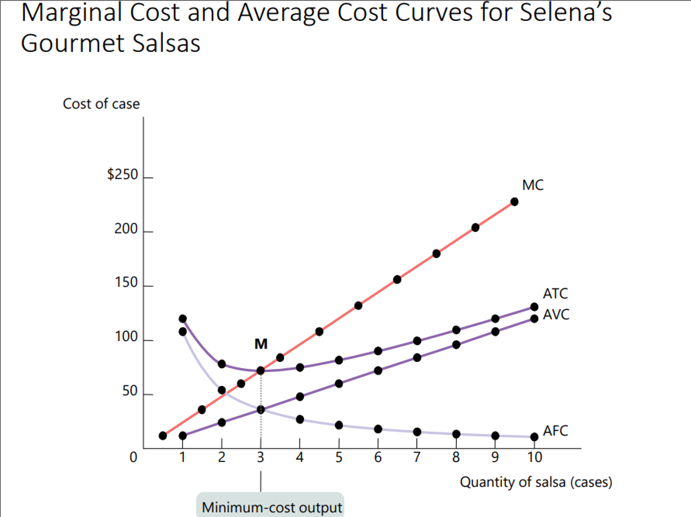
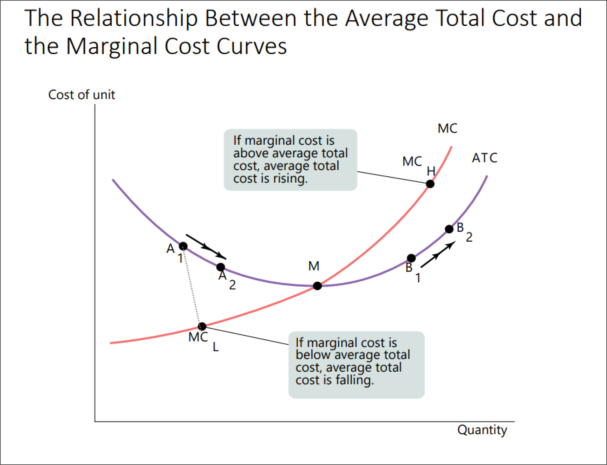
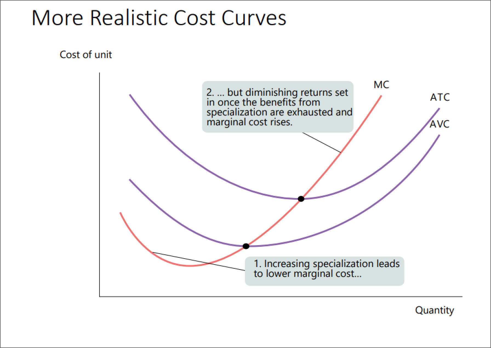
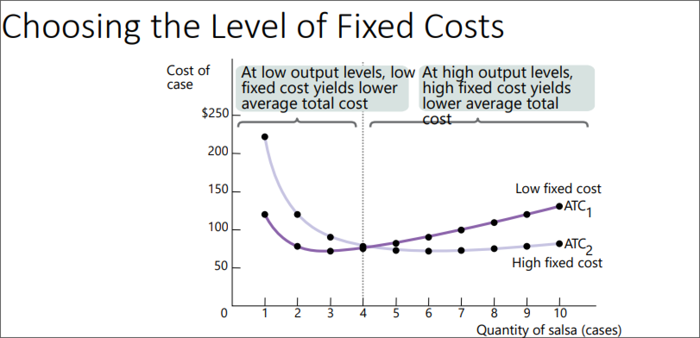
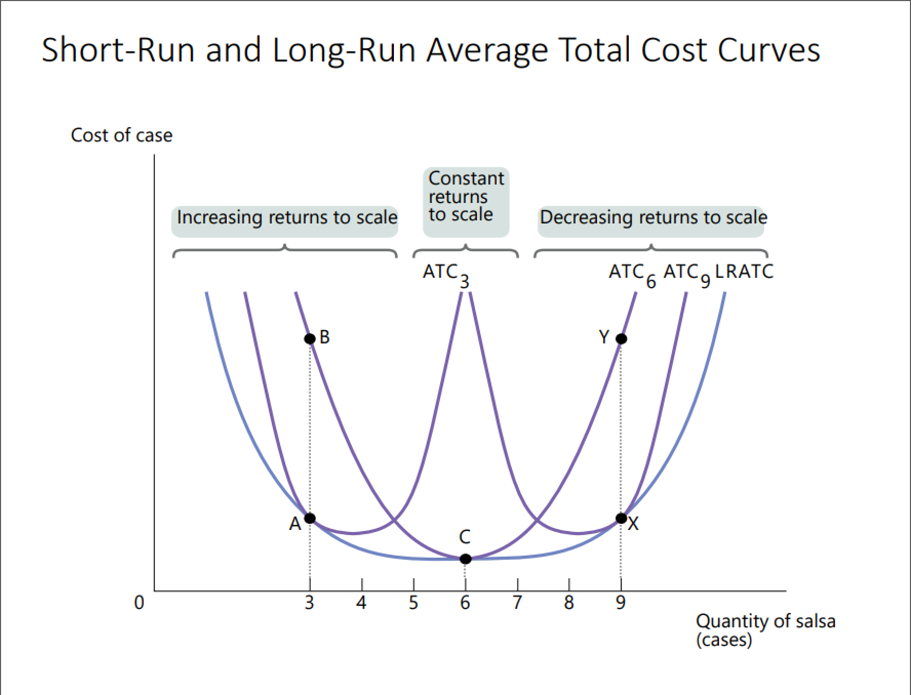

- #+BEGIN_PINNED
  The **production function** is the relationship between the *quantity of inputs a firm uses* and *the quantity of output it produces*. #definition 
  #+END_PINNED
- #+BEGIN_PINNED
  A **fixed input** is an input whose quantity is fixed for a period of time and cannot be varied. #definition 
  #+END_PINNED
- #+BEGIN_PINNED
  A **variable input** is an input whose quantity the firm can vary. #definition 
  #+END_PINNED
- A production formula can be written in the form as $Y = f(L, K)$, where Y is *output*, L is *labor*, and K is *capital*.
- #+BEGIN_NOTE
  In the ==long run== all inputs can be varied.
  
  In the ==short run== at least one input is fixed.
  #+END_NOTE
- #+BEGIN_PINNED
  The **total output curve** shows how the quantity of output depends on the quantity of the variable input, for a given quantity of the fixed input. #definition 
  #+END_PINNED
	- 
	- #+BEGIN_NOTE
	  Fixed input in this example can be machinery and land area.
	  #+END_NOTE
- #+BEGIN_PINNED
  The **marginal product** of an input is the *additional quantity of output* that is produced by using one *more unit of input*. #definition 
  #+END_PINNED
	- 
	- #+BEGIN_NOTE
	  There are ==diminishing returns to an input== when an increase in the quantity of that input, holding all the other inputs fixed, leads to a decline in the *marginal product* of that input. 
	  #+END_NOTE
- Marginal Product Formula #formula
	- #+BEGIN_IMPORTANT
	  
	  #+BEGIN_EXPORT latex
	  \text{marginal product} = \frac{\Delta \text{unit of output}}{\Delta \text{unit of input}}
	  #+END_EXPORT 
	  #+END_IMPORTANT
- #+BEGIN_PINNED
  A **fixed cost** is a cost that does not depend on the quantity of output produced. It is the cost of the *fixed input*. #definition 
  #+END_PINNED
- #+BEGIN_PINNED
  A **variable cost** is a cost that depends on the quantity of output produced. It is the cost of the *variable input*. #definition 
  #+END_PINNED
- #+BEGIN_PINNED
  The **total cost** of producing a given quantity of output is  the sum of the *fixed cost* and the *variable cost* of producing that quantity of output. #definition 
  #+END_PINNED
- Total Cost Formula #formula
	- #+BEGIN_IMPORTANT
	  
	  #+BEGIN_EXPORT latex
	  \text{total cost} = \text{fixed costs} + \text{variable costs}
	  #+END_EXPORT 
	  #+END_IMPORTANT
	- 
	- #+BEGIN_NOTE
	  Because of ==diminishing returns== one is going to need more labor to increase output by a constant amount, hence cost rises.
	  #+END_NOTE
- Marginal Cost Formula #formula
	- #+BEGIN_IMPORTANT
	  
	  #+BEGIN_EXPORT latex
	  \text{marginal cost} = \frac{\Delta \text{ total cost}}{\Delta \text{ quantity of ouptut}}
	  #+END_EXPORT 
	  #+END_IMPORTANT
- #+BEGIN_NOTE
  *Marginal cost curve* = *supply curve*
  #+END_NOTE
- 
- Average Cost Formula #formula
	- #+BEGIN_IMPORTANT
	  
	  #+BEGIN_EXPORT latex
	  \text{average cost} = \frac{\text{total cost}}{\text{quantity of ouptut}}
	  #+END_EXPORT 
	  #+END_IMPORTANT
- Average Fixed Cost Formula #formula
	- #+BEGIN_IMPORTANT
	  #+BEGIN_EXPORT latex
	  \text{average cost} = \frac{\text{fixed cost}}{\text{quantity of ouptut}}
	  #+END_EXPORT 
	  #+END_IMPORTANT
- Average Variable Cost Formula #formula
	- #+BEGIN_IMPORTANT
	  #+BEGIN_EXPORT latex
	  \text{average cost} = \frac{\text{variable cost}}{\text{quantity of ouptut}}
	  #+END_EXPORT 
	  #+END_IMPORTANT
- #+BEGIN_PINNED
  The **spreading effect** states that the larger the output, the greater the quantity of output over which fixed cost is spread, leading to *lower average fixed cost*. #definition 
  #+END_PINNED
- #+BEGIN_PINNED
  The **diminishing returns effect** states that the larger the output, the greater amount of variable input required to produce additional units leading to higher average variable cost. #definition
  #+END_PINNED
- 
	- Shape determined by the ==spreading effect== and the ==diminishing returns effect==.
- 
- #+BEGIN_NOTE
  *Average cost curve* intersects the *marginal curve* at the ==minimum average cost==.
  #+END_NOTE
- 
- #+BEGIN_NOTE
  Marginal cost curves could start off as *downward sloping* as a few workers cannot reap the benefits of specialization. Eventually, the curve will slope upwards.
  #+END_NOTE
	- 
		- #+BEGIN_NOTE
		  *Marginal curve* intersects the curves at their respective lowest points.
		  #+END_NOTE
- 
- #+BEGIN_PINNED
  The **long run average total cost curve** shows the relationship between input and average total cost when fixed cost has been chosen to minimize average total cost for each level of output. #definition 
  #+END_PINNED
	- 
- increasing and decreasing and constant returns to scale definitions