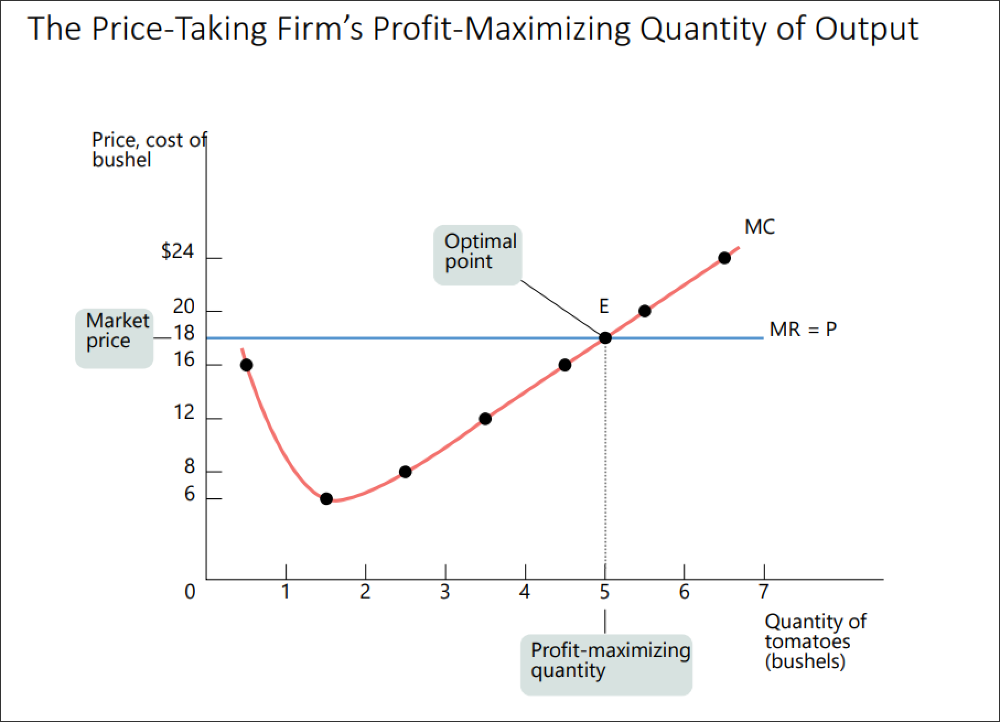
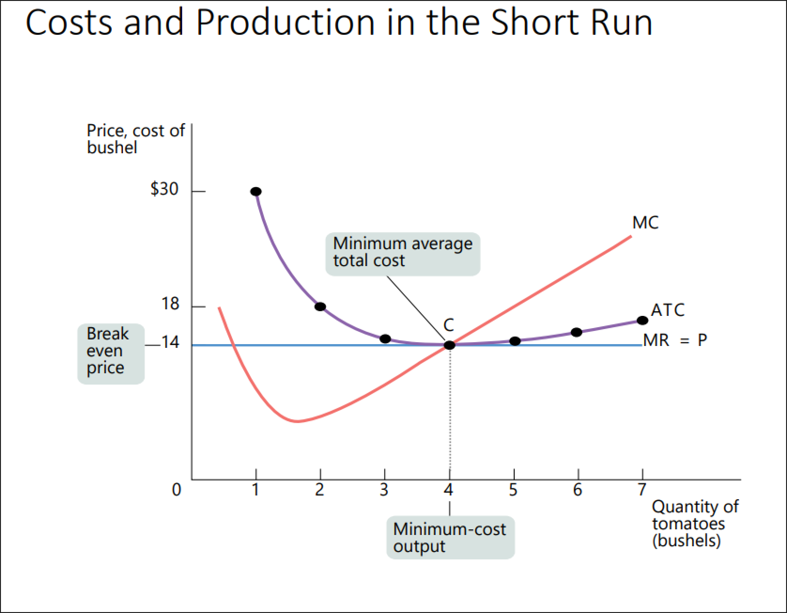
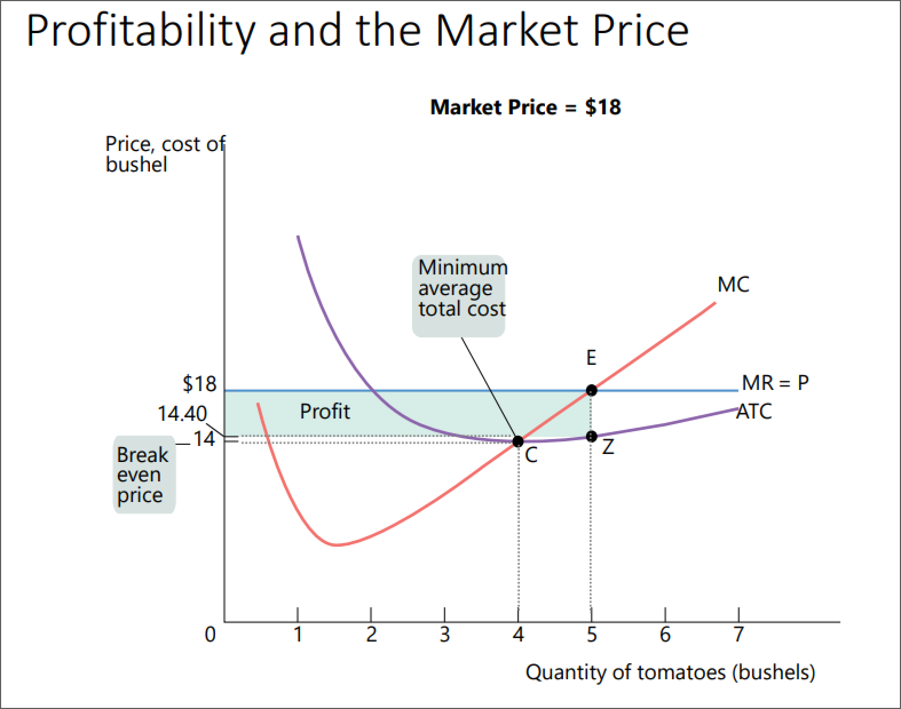
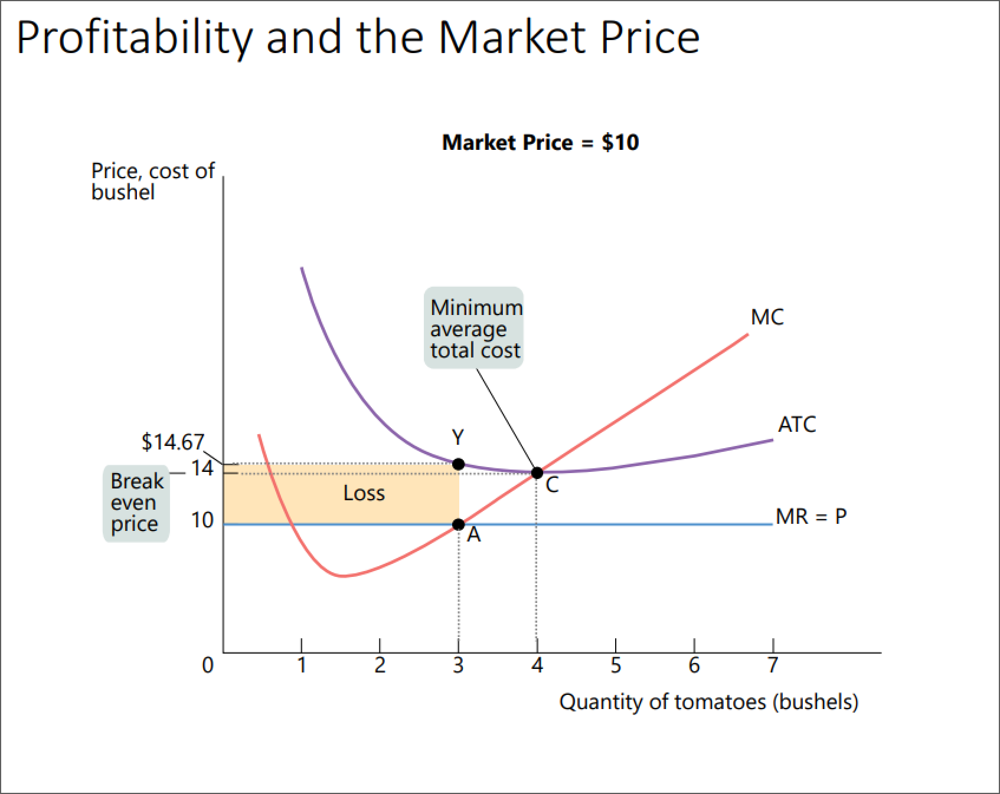
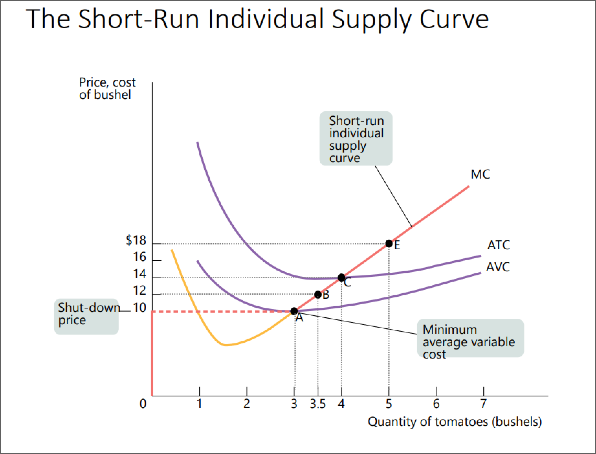

id:: 6551e449-a6e5-4267-8724-8339f53269ee
#+BEGIN_PINNED
A **price-taking consumer** is a consumer who has no effect on the market price. #definition 
#+END_PINNED

- #+BEGIN_PINNED
  A **price-taking producer** is a producer who has no effect on the market price. #definition 
  #+END_PINNED
- #+BEGIN_PINNED
  A **perfectly competitive market** is a market in which all *participants* are *price-takers*. #definition 
  #+END_PINNED
- id:: 6551e660-053b-47c7-a76b-dab7e3c84227
  #+BEGIN_PINNED
  A **perfectly competitive industry** is a market in which all *producers* are *price-takers*. #definition 
  #+END_PINNED
- #+BEGIN_PINNED
  **Market share** is the fraction of the total industry output accounted for by that producer's output. #definition 
  #+END_PINNED
- #+BEGIN_PINNED
  A **standardized / homogeneous good** when consumers regard the products of different producers as equal. #definition 
  #+END_PINNED
- Conditions for perfectly competitive market:
	- Many producers, none of whom have a *large market share*
	  logseq.order-list-type:: number
	- Producers regard all products as *equal*
	  logseq.order-list-type:: number
	- There is *free entry and exit* into and from an industry
	  logseq.order-list-type:: number
		- ensures that number of producers can adjust to changing market conditions
		  logseq.order-list-type:: number
		- producers cannot artificially keep other firms out of the market
		  logseq.order-list-type:: number
- #+BEGIN_PINNED
  **Marginal revenue** is the revenue generated by an additional unit of output. #definition 
  #+END_PINNED
- Marginal Revenue Formula #formula
	- #+BEGIN_IMPORTANT
	  
	  #+BEGIN_EXPORT latex
	  
	  #+END_EXPORT 
	  #+END_IMPORTANT
- #+BEGIN_PINNED
  The **optimal output rule** states that profit is maximized by producing the quantity of output at which the marginal cost of the last unit produced is equal to its marginal revenue (= *price*). #definition 
  #+END_PINNED
	- 
		- #+BEGIN_NOTE
		  Since price-takers have no effect on the market, no matter of the quantity they produce, the market price will be constant (*MR*).
		  #+END_NOTE
- #+BEGIN_NOTE
  If total revenue > total cost, firm is *profitable*.
  
  If total revenue = total cost, firm is *breaks even*.
  
  If total revenue < total cost, firm is *not-profitable*.
  #+END_NOTE
	- 
	- 
	- 
- #+BEGIN_PINNED
  The **break even price** is the price at which the firm earns zero profits. #definition 
  #+END_PINNED
	- 