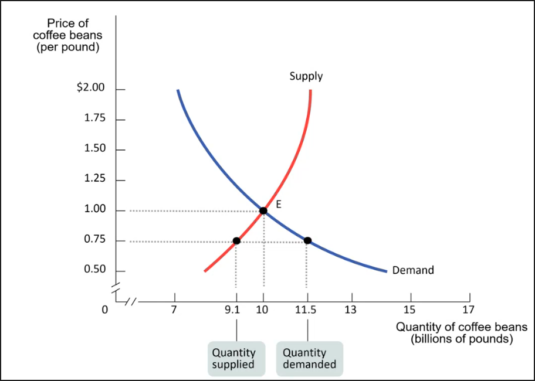

# Markets
	- #+BEGIN_PINNED
	  A **market** is the impersonal exchange of goods and services by means of directly reciprocated transfers, voluntarily entered into for mutual benefit. #definition 
	  #+END_PINNED
	- A _competitive_ market:
		- has many buyers and sellers
		- same good or service (i.e. homogeneous)
	- Supply and demand show how competitive a market is.
- # Demand Curves
	- #+BEGIN_PINNED
	  A **demand schedule** shows how much of a good or a service consumers will want to buy at different prices. #definition 
	  #+END_PINNED
	- #+BEGIN_PINNED
	  A **demand curve** is a graphical representation of the _demand schedule_ . #definition 
	  #+END_PINNED
	- 
	- Negative slope (price drops -> quantity of demand increases)
	- #+BEGIN_NOTE
	  _Quantity in demand_ is the amount of goods consumers are willing to purchase at a given price point. It is a particular _point_ on the _demand curve_.
	  
	  _Demand_ is the entire relationship between the price of a good and and the quantity that the consumers are wiling to purchase of it. It is the _demand curve_ itself.
	  #+END_NOTE
	- Quantity in Demand Formula #formula
		- #+BEGIN_IMPORTANT
		  #+BEGIN_EXPORT latex
		  \textbf{quantity in demand (at a price point)} = \text{buyers at that price} \times \text{total population}
		  #+END_EXPORT
		  #+END_IMPORTANT
	- Demand increases when there are more buyers
		- E.g. increase in population -> rise in quantity demanded at each price point -> increase in demand       -> curve is shifted
	- Factors that shift _demand curve_:
		- Increase in population
		  logseq.order-list-type:: number
		- Changes in the prices of related goods
		  logseq.order-list-type:: number
			- Two types of related goods:
				- logseq.order-list-type:: number
				  id:: 6508271a-aa0b-48bd-88b7-f00e618da661
				  #+BEGIN_PINNED
				  **Substitutes** are goods that when their prices fall, consumers are less likely to buy another good. #definition 
				  #+END_PINNED
				- logseq.order-list-type:: number
				  #+BEGIN_PINNED
				  **Complements** are goods that when their prices fall, consumers are more likely to buy another good. #definition 
				  #+END_PINNED
		- Changes in income
		  logseq.order-list-type:: number
			- #+BEGIN_PINNED
			  **Normal goods** are goods whose demand rises when income rises. #definition 
			  #+END_PINNED
			- #+BEGIN_PINNED
			  **Inferior goods** are goods whose demand decreases when income rises. #definition 
			  #+END_PINNED
		- Changes in taste
		  logseq.order-list-type:: number
		- Changes in expectations
		  logseq.order-list-type:: number
- # Supply Curves
	- #+BEGIN_PINNED
	  **Supply schedule** shows how much of a good or service would be supplied at different prices. #definition 
	  #+END_PINNED
	- #+BEGIN_PINNED
	  **Supply curve** is a graphical representation of how much of a good or service people are willing to sell. #definition 
	  #+END_PINNED
	- 
	- Positive slope (the higher the price, the more people want to sell)
	- Factors that shift the _supply curve_:
		- Changes in input prices
		  logseq.order-list-type:: number
			- #+BEGIN_PINNED
			  An **input** is a good that is used to produce another good. #definition 
			  #+END_PINNED
		- Changes in the prices of related services or goods
		  logseq.order-list-type:: number
		- Changes in the prices of input goods
		  logseq.order-list-type:: number
		- Changes in technology
		  logseq.order-list-type:: number
		- Changes in expectations
		  logseq.order-list-type:: number
		- Changes in number of producers
		  logseq.order-list-type:: number
- # Aggregate Market Curves
	- #+BEGIN_PINNED
	  An **aggregate market curve** is a curve that is a sum of all the supply-demand curves of the population. #definition 
	  #+END_PINNED
	- 
	- 
- # Equilibrium
	- #+BEGIN_PINNED
	  **Equilibrium** is when _quantity of a demanded good_ matches the _quantity of supplied of that good_. #definition 
	  #+END_PINNED
	- #+BEGIN_PINNED
	  **Equilibrium price** (a.k.a. **market clearing price**)is the price point at which the equilibrium takes place. #definition 
	  #+END_PINNED
	- #+BEGIN_PINNED
	  **Equilibrium quantity** is the quantity at which the equilibrium takes place. #definition 
	  #+END_PINNED
	- 
	- _Surpluses_ and _shortages_ push towards equilibrium.
		- Surplus (price goes down)
			- 
		- Shortage (price goes up)
			- 
	- At equilibrium every buyer has a seller and vice versa.
	- Equilibrium changes with shifts in supply and demand.
	- What happens when prices and demand increase?
		- Something causes demand to rise (demand curve shifted to the right)
		  logseq.order-list-type:: number
		- Equilibrium moves up along the supply curve
		  logseq.order-list-type:: number
			- _Equilibrium price_ and _equilibrium quantity_ increase
		- 
	- Another example with supply shift (e.g. technological advance):
		- 
	- Simultaneous shifts of _supply and demand_:
		- 
			- Supply decreases -> quantity decreases, price increases
			  logseq.order-list-type:: number
			- Demand increases -> quantity increases, price increases
			  logseq.order-list-type:: number
			- #+BEGIN_NOTE
			  Since _quantity_ both decreased and increased, it is dependent on the shifts of the curves. Therefore, it is _ambiguous_ to determine the net increase.
			  
			  _Price_, however, increased both times, hence we know _unequivocally_ that it has a net increase.
			  #+END_NOTE
			- #+BEGIN_IMPORTANT
			  Either _price_ or _quantity_ will be _ambiguous_. The other will be _unambiguous_.
			  #+END_IMPORTANT