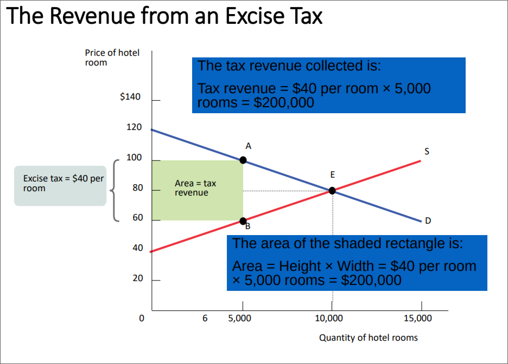
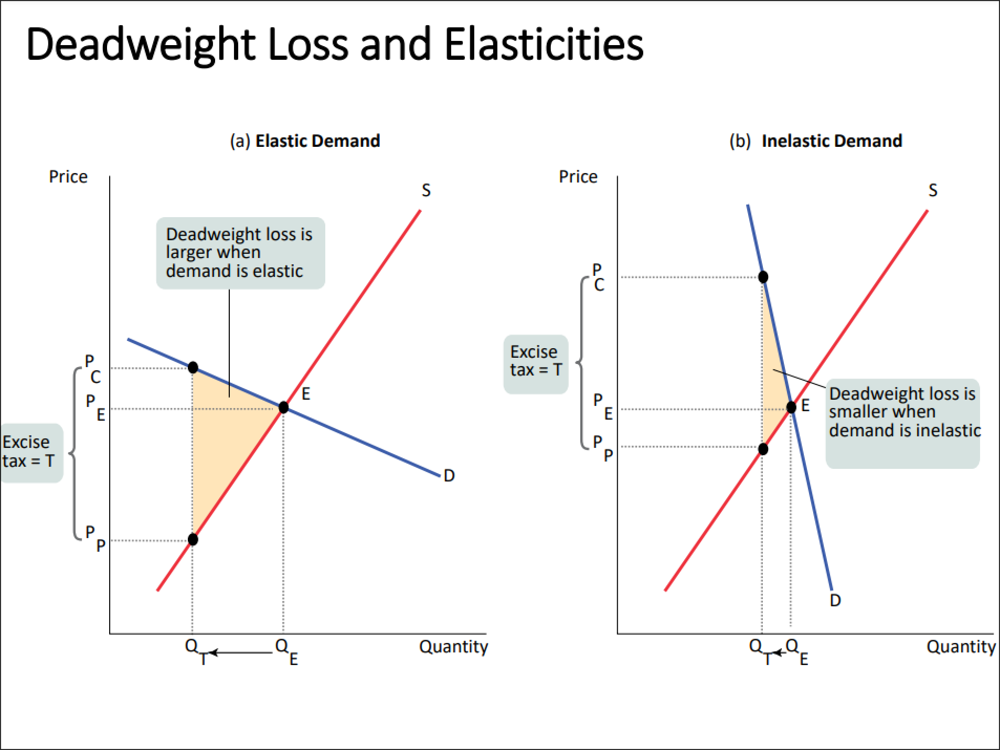

- #+BEGIN_PINNED
  **Non-exclude-able** are things that can be used by the public. #definition 
  #+END_PINNED
- #+BEGIN_PINNED
  **Non-rival** means people can use the services independently from each other. #definition 
  #+END_PINNED
- #+BEGIN_PINNED
  **Externalities** are consequences (whether good or bad) of an action. #definition 
  #+END_PINNED
- *Non-exclude-able* and *non-rival* goods provide no incentives for producers. So government must step in. Where does the government get money from? ==Taxes==.
- # Excise Taxes
	- #+BEGIN_PINNED
	  An **excise tax** is a tax on sales of a good or service. #definition 
	  #+END_PINNED
		- *Excise taxes*:
			- raise prices paid by buyers
			- reduce the price received by sellers
		- 
		- #+BEGIN_NOTE
		  *Supply curve* is ==shifted== because *input cost* increases.
		  #+END_NOTE
		- #+BEGIN_NOTE
		  We can also view *taxation* from the consumer side.
		  #+END_NOTE
		- 
		- #+BEGIN_PINNED
		  The **incidence** of a tax is a measure of who pays it. #definition 
		  #+END_PINNED
		- The party that pays does not necessarily bare the brunt of the tax. This depends on the *supply and demand curve*.
			- 
			- 
			- #+BEGIN_NOTE
			  Given a *high elasticity of demand* the *incidence of the tax* is going to fall on ==producers==.
			  
			  Given a *high elasticity of supply* the *incidence of the tax* is going to fall on ==consumers==.
			  #+END_NOTE
				- e.g. supply and demand for insulin
					- {{renderer excalidraw, excalidraw-2023-10-16-10-08-16}}
	- Tax Revenue Formula #formula
		- #+BEGIN_IMPORTANT
		  
		  #+BEGIN_EXPORT latex
		  \text{tax revenue} = \text{quantity after tax} \times |\text{consumer price} - \text{producer price}|
		  #+END_EXPORT 
		  #+END_IMPORTANT
	- 
	- Lafford Curve
		- {{renderer excalidraw, excalidraw-2023-10-16-10-25-23}}
	- 
	- There exists a point where *tax revenue* will peak.
	- Deadweight loss of taxation:
		- 
		- 
		- 
	- #+BEGIN_NOTE
	  You should tax for which *demand* or *supply* is ==inelastic==.
	  #+END_NOTE
		- e.g. tax on gasoline
	- #+BEGIN_NOTE
	  There is also an *administrative cost* of collecting taxes.
	  #+END_NOTE
- tax rate
- # Tax Fairness and Tax Efficiency
	- #+BEGIN_PINNED
	  The **ability-to-pay** principle means that people who are willing to pay more should pay more. #definition 
	  #+END_PINNED
	- #+BEGIN_PINNED
	  The **lump-sum** principle means that the price is the same for everyone. #definition 
	  #+END_PINNED
	- #+BEGIN_PINNED
	  **Progressive taxes** take a larger share of the income of the high-income taxpayers than of low-income taxpayers. #definition 
	  #+END_PINNED
	- #+BEGIN_PINNED
	  **Regressive taxes** take a smaller share of income of high-income taxpayers than of low-income taxpayers. #definition 
	  #+END_PINNED