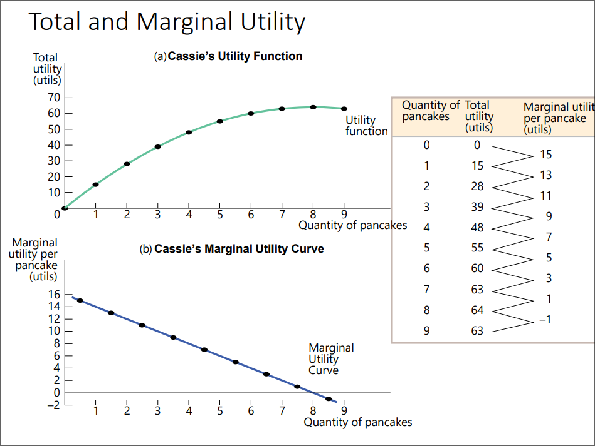
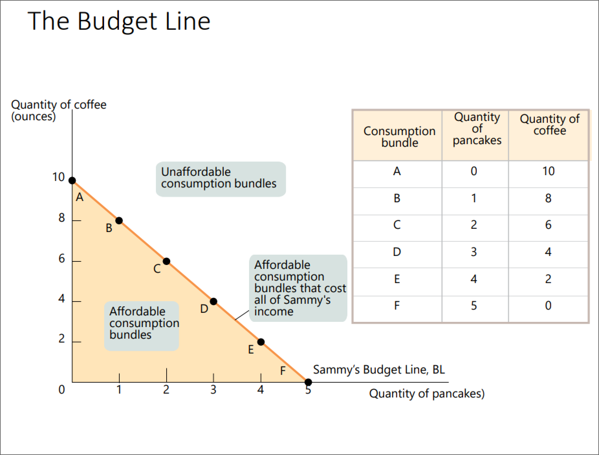
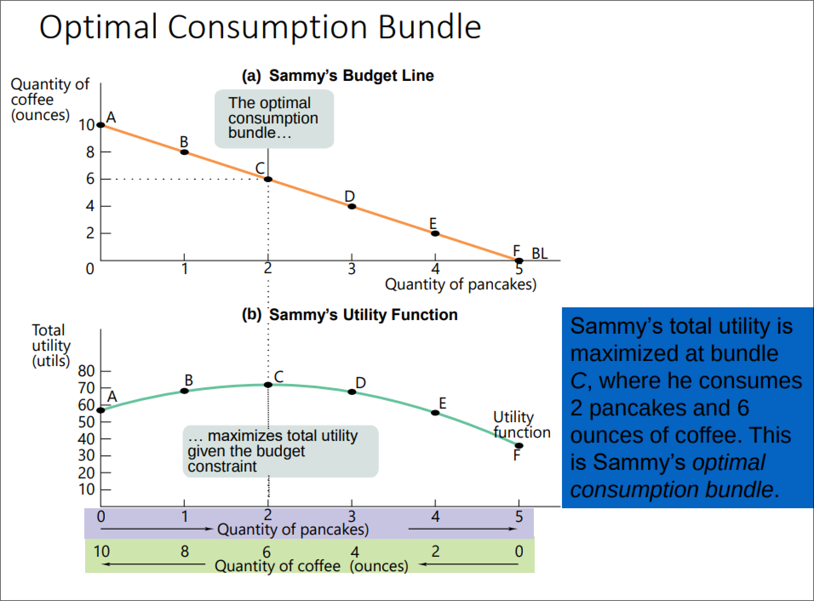

- #+BEGIN_PINNED
  **Utility** is the measure of happiness (measured in ==util==). #definition 
  #+END_PINNED
- #+BEGIN_PINNED
  A **consumption bundle** is the collection of all goods and services consumed by an individual. #definition 
  #+END_PINNED
- #+BEGIN_PINNED
  A **utility function** gives the *total utility* generated by an individual's *consumer bundle*. #definition 
  #+END_PINNED
- #+BEGIN_PINNED
  **Marginal utility** is the change in total utility gained by consuming another additional unit of a good or service. #definition 
  #+END_PINNED
	- 
- #+BEGIN_NOTE
  *The Principle of Marginal Utility* states that each successive unit of a good or service consumed adds less to total utility than the previous unit. 
  #+END_NOTE
- #+BEGIN_PINNED
  **Consumption possibilities**is the set of all consumption bundles that can be consumed given the consumer's income and prevailing prices. #definition 
  #+END_PINNED
- #+BEGIN_PINNED
  A **budget line** shows the consumption bundles available to a consumer who spends all of their income. #definition 
  #+END_PINNED
	- 
- #+BEGIN_PINNED
  The **optimal consumption bundle** is the one that ==maximizes consumer utility== given their *budget constraint*. #definition 
  #+END_PINNED
	- 