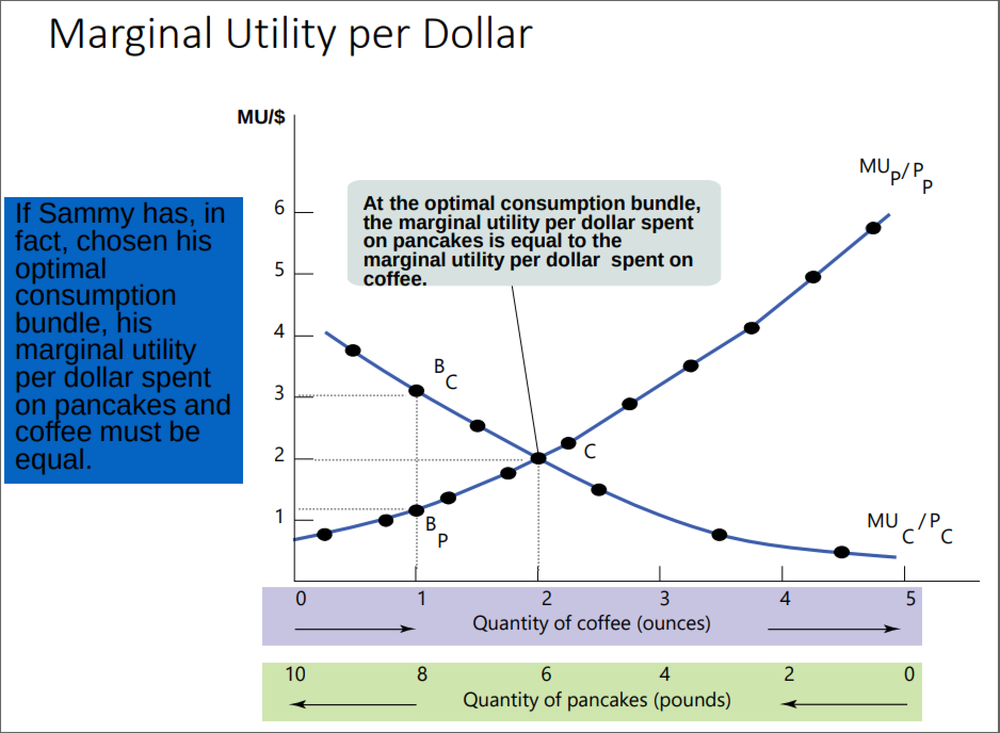

- #+BEGIN_PINNED
  **Utility** is the measure of happiness (measured in ==util==). #definition 
  #+END_PINNED
- #+BEGIN_PINNED
  A **consumption bundle** is the collection of all goods and services consumed by an individual. #definition 
  #+END_PINNED
- #+BEGIN_PINNED
  A **utility function** gives the *total utility* generated by an individual's *consumer bundle*. #definition 
  #+END_PINNED
- #+BEGIN_PINNED
  **Marginal utility** is the change in total utility gained by consuming another additional unit of a good or service. #definition 
  #+END_PINNED
	- 
- #+BEGIN_NOTE
  *The Principle of Marginal Utility* states that each successive unit of a good or service consumed adds less to total utility than the previous unit. 
  #+END_NOTE
- #+BEGIN_PINNED
  **Consumption possibilities**is the set of all consumption bundles that can be consumed given the consumer's income and prevailing prices. #definition 
  #+END_PINNED
- #+BEGIN_PINNED
  A **budget line** shows the consumption bundles available to a consumer who spends all of their income. #definition 
  #+END_PINNED
	- 
- #+BEGIN_PINNED
  The **optimal consumption bundle** is the one that ==maximizes consumer utility== given their *budget constraint*. #definition 
  #+END_PINNED
	- 
- #+BEGIN_PINNED
  The **marginal utility per dollar** is the additional utility from spending one more dollar on a good or service. #definition 
  #+END_PINNED
- Marginal Utility per Dollar Formula #formula
	- #+BEGIN_IMPORTANT
	  
	  #+BEGIN_EXPORT latex
	  \text{marginal utility per dollar} = \frac{\text{marginal utility per unit of good}}{\text{cost per unit of of good}}
	  #+END_EXPORT 
	  #+END_IMPORTANT
- #+BEGIN_NOTE
  ==Optimal consumption bundle== is reached when the *marginal utility per dollar* of all goods in your *consumption bundle* is equalized.
  #+END_NOTE
	- #+BEGIN_EXPORT latex
	  \frac{\text{marginal utility of good A}}{\text{price of good A}} = \frac{\text{marginal utility of good B}}{\text{price of good B}}
	  #+END_EXPORT
	- 
- #+BEGIN_PINNED
  The **substitution effect** of a good is when its substitutes get *cheaper* and the original good has become relatively *more expensive*, hence ==less of the good is consumed.== #definition 
  #+END_PINNED
- #+BEGIN_PINNED
  The **income effect** is the *change of quantity of good consumed* because there is a change in the ==purchasing power== of the consumer. #definition 
  #+END_PINNED
	-
	- *Normal goods* $\implies$ quantity demanded increases when income increases
	- *Inferior goods* $\implies$ quantity demanded decreases when income increases